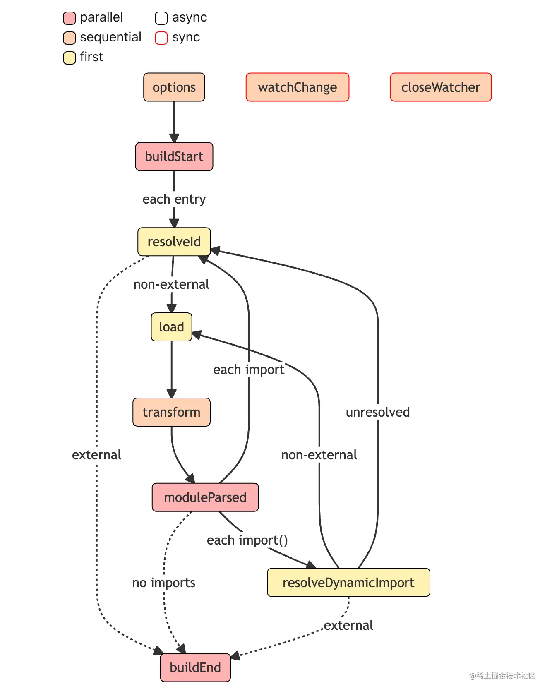
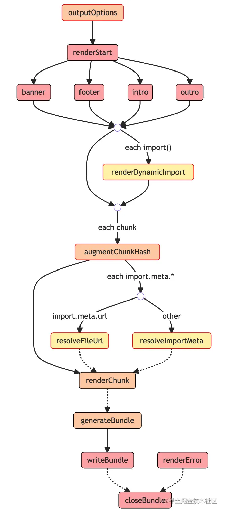

### Rollup 整体构建阶段

build => output => close

```ts
// Build 阶段
const bundle = await rollup.rollup(inputOptions);

// Output 阶段
await Promise.all(outputOptions.map(bundle.write));

// 构建结束
await bundle.close();
```

#### bundle

可以看 build.js 中打印的

```ts
{
  cache: {
    modules: [
      {
        ast: 'AST 节点信息，具体内容省略',
        code: 'export const a = 1;',
        dependencies: [],
        id: '/Users/wangmaoquan/project/rollup/learn-rollup/src/utils/index.ts',
        // 其它属性省略
      },
      {
        ast: 'AST 节点信息，具体内容省略',
        code: "import { add } from './utils';\n" +
        '// @ts-ignore\n' +
        "// import { merge } from 'lodash';\n" +
        '// console.log(merge);\n' +
        'console.log(add(1, 2));\n' +
        '//# sourceMappingURL=index.js.map'
        dependencies: ['/Users/wangmaoquan/project/rollup/learn-rollup/src/utils/index.ts' ],
        id: '/Users/wangmaoquan/project/rollup/learn-rollup/src/index.ts',
        // 其它属性省略
      }
    ],
    plugins: {}
  },
  closed: false,
  // 挂载后续阶段会执行的方法
  close: [AsyncFunction: close],
  generate: [AsyncFunction: generate],
  write: [AsyncFunction: write]
}

```

从上面的信息中可以看出，目前经过 Build 阶段的 bundle 对象其实并没有进行**模块的打包**，这个对象的作用在于存储各个模块的内容及依赖关系，同时暴露 `generate` 和 `write` 方法，以进入到后续的 Output 阶段（write 和 generate 方法唯一的区别在于前者打包完产物会写入磁盘，而后者不会）

**输出如下**

```ts
{
  output: [
    {
      exports: [],
      facadeModuleId: '/Users/wangmaoquan/project/rollup/learn-rollup/src/index.ts',
      isDynamicEntry: false,
      isEntry: true,
      isImplicitEntry: false,
      moduleIds: [Array],
      name: 'index',
      type: 'chunk',
      dynamicImports: [],
      fileName: 'index.js',
      implicitlyLoadedBefore: [],
      importedBindings: {},
      imports: [],
      modules: [Object: null prototype],
      referencedFiles: [],
      code: 'var add = function (a, b) { return a + b; };\n' +
        '\n' +
        '// @ts-ignore\n' +
        "// import { merge } from 'lodash';\n" +
        '// console.log(merge);\n' +
        'console.log(add(1, 2));\n',
      map: null
    }
  ]
}
```

对于一次完整的构建过程而言， Rollup 会先进入到 `Build` 阶段，解析各模块的内容及依赖关系，然后进入 `Output` 阶段，完成打包及输出的过程

## 拆解插件工作流

### 谈谈插件 Hook 类型

插件的各种 Hook 可以根据这两个构建阶段分为两类: `Build Hook` 与 `Output Hook`

- `Build Hook` 即在 Build 阶段执行的钩子函数，在这个阶段主要进行模块代码的转换、AST 解析以及模块依赖的解析，那么这个阶段的 Hook 对于代码的操作粒度一般为模块级别，也就是单文件级别
- `Ouput Hook`(官方称为 Output Generation Hook)，则主要进行代码的打包，对于代码而言，操作粒度一般为 chunk 级别(一个 chunk 通常指很多文件打包到一起的产物)

除了根据构建阶段可以将 Rollup 插件进行分类，根据不同的 Hook 执行方式也会有不同的分类，主要包括 `Async、Sync、Parallel、Squential、First` 这五种

1. Async & Sync
   首先是 `Async` 和 `Sync` 钩子函数，两者其实是相对的，分别代表异步和同步的钩子函数，两者最大的区别在于同步钩子里面不能有异步逻辑，而异步钩子可以有。
2. Parallel
   这里指并行的钩子函数。如果有多个插件实现了这个钩子的逻辑，一旦有钩子函数是异步逻辑，则并发执行钩子函数，不会等待当前钩子完成(底层使用 Promise.all)。
   比如对于 `Build` 阶段的 `buildStart` 钩子，它的执行时机其实是在构建刚开始的时候，各个插件可以在这个钩子当中做一些状态的初始化操作，但其实插件之间的操作并`不是相互依赖`的，也就是可以并发执行，从而提升构建性能。反之，对于需要依赖其他插件处理结果的情况就不适合用 Parallel 钩子了，比如 `transform`。
3. Sequential
   `Sequential` 指串行的钩子函数。这种 Hook 往往适用于插件间处理结果相互依赖的情况，前一个插件 Hook 的返回值作为后续插件的入参，这种情况就需要等待前一个插件执行完 Hook，获得其执行结果，然后才能进行下一个插件相应 Hook 的调用，如 `transform`
4. First
   如果有多个插件实现了这个 Hook，那么 Hook 将依次运行，直到返回一个`非 null 或非 undefined` 的值为止。比较典型的 Hook 是 `resolveId`，一旦有插件的 `resolveId` 返回了一个路径，将停止执行后续插件的 `resolveId` 逻辑

Rollup 当中不同插件 Hook 的类型，实际上不同的类型是可以叠加的，`Async/Sync` 可以搭配后面三种类型中的任意一种，比如一个 Hook 既可以是 Async 也可以是 First 类型

### Build 阶段工作流



1. 首先经历 `options` 钩子进行配置的转换，得到处理后的配置对象
2. 随之 Rollup 会调用 `buildStart(Parallel & Async)` 钩子，正式开始构建流程
3. Rollup 先进入到 `resolveId(First & Async)` 钩子中解析文件路径(从 input 配置指定的入口文件开始)
4. Rollup 通过调用 `load(First & Async)` 钩子加载模块内容
5. 紧接着 Rollup 执行所有的 `transform(Sequential & Async)` 钩子来对模块内容进行进行自定义的转换，比如 babel 转译
6. Rollup 拿到最后的模块内容，进行 AST 分析，得到所有的 import 内容，调用 `moduleParsed(Parallel & Async)` 钩子
   - 6.1 如果是普通的 import，则执行 resolveId 钩子，继续回到`步骤 3`
   - 6.2 如果是动态 import，则执行 `resolveDynamicImport(First & Async)` 钩子解析路径，如果解析成功，则回到`步骤 4` 加载模块，否则回到`步骤 3` 通过 resolveId 解析路径
7. 直到所有的 import 都解析完毕，Rollup 执行 `buildEnd(Parallel & Async)` 钩子，Build 阶段结束

当然，在 Rollup 解析路径的时候，即执行 `resolveId` 或者 `resolveDynamicImport` 的时候，有些路径可能会被标记为 `external(翻译为排除)`，也就是说不参加 Rollup 打包过程，这个时候就不会进行 `load、transform` 等等后续的处理了

### Output 阶段工作流



1. 执行所有插件的 `outputOptions(Sequential & Sync)` 钩子函数，对 output 配置进行转换
2. 执行 `renderStart(Parallel & Async)`，并发执行 renderStart 钩子，正式开始打包
3. 并发执行所有插件的 `banner、footer、intro、outro(Parallel & Async)` 钩子(底层用 Promise.all 包裹所有的这四种钩子函数)，这四个钩子功能很简单，就是往打包产物的固定位置(比如头部和尾部)插入一些自定义的内容，比如协议声明内容、项目介绍等等
4. 从入口模块开始扫描，针对动态 import 语句执行 `renderDynamicImport(First & Sync)` 钩子，来自定义动态 import 的内容
5. 对每个即将生成的 chunk，执行 `augmentChunkHash(Sequential & Async)` 钩子，来决定是否更改 chunk 的哈希值，在 watch 模式下即可能会多次打包的场景下，这个钩子会比较适用
6. 如果没有遇到 import.meta 语句，则进入下一步，否则
   - 6.1 对于 import.meta.url 语句调用 `resolveFileUrl(First & Sync)` 来自定义 url 解析逻辑
   - 6.2 对于其他 import.meta 属性，则调用 `resolveImportMeta(First & Sync)` 来进行自定义的解析
7. 接着 Rollup 会生成所有 chunk 的内容，针对每个 chunk 会依次调用插件的 `renderChunk(Sequential & Async)` 方法进行自定义操作，也就是说，在这里时候你可以直接操作打包产物了
8. 随后会调用 `generateBundle(Sequential & Async)` 钩子，这个钩子的入参里面会包含所有的打包产物信息，包括 chunk (打包后的代码)、asset(最终的静态资源文件)。你可以在这里删除一些 chunk 或者 asset，最终这些内容将不会作为产物输出
9. 前面提到了 `rollup.rollup` 方法会返回一个 `bundle` 对象，这个对象是包含 `generate` 和 `write` 两个方法，两个方法唯一的区别在于后者会将代码写入到磁盘中，同时会触发 `writeBundle(Parallel & Async)` 钩子，传入所有的打包产物信息，包括 `chunk` 和 `asset`，和 `generateBundle` 钩子非常相似。不过值得注意的是，这个钩子执行的时候，产物已经输出了，而 `generateBundle` 执行的时候产物还并没有输出 `generateBundle => 输出产物到磁盘 => writeBundle`
10. 当上述的 bundle 的 close 方法被调用时，会触发 `closeBundle(Parallel & Async)` 钩子，到这里 Output 阶段正式结束

> 注意: 当打包过程中任何阶段出现错误，会触发 `renderError(Parallel & Async)` 钩子，然后执行 closeBundle 钩子结束打包。

### 常用 hook 实战

`列举的插件, 我后续会单独阅读源码`

1. 路径解析: resolveId
   [alias 插件](https://github.com/rollup/plugins/blob/master/packages/alias/src/index.ts)
2. load
   [image 插件](https://github.com/rollup/plugins/blob/master/packages/image/src/index.js)
3. 代码转换: transform
4. Chunk 级代码修改: renderChunk
   [replace 插件](https://github.com/rollup/plugins/blob/master/packages/replace/src/index.js)
5. 产物生成最后一步: generateBundle
   [html 插件](https://github.com/rollup/plugins/blob/master/packages/html/src/index.ts)

### 总结

Rollup 的插件开发整体上是非常简洁和灵活的

- 插件逻辑集中管理。各个阶段的 Hook 都可以放在一个插件中编写，比如上述两个 Webpack 的 Loader 和 Plugin 功能在 Rollup 只需要用一个插件，分别通过 transform 和 renderChunk 两个 Hook 来实现
- 插件 API 简洁，符合直觉。Rollup 插件基本上只需要返回一个包含 name 和各种钩子函数的对象即可，也就是声明一个 name 属性，然后写几个钩子函数即可
- 插件间的互相调用。比如刚刚介绍的 alias 插件，可以通过插件上下文对象的 resolve 方法，继续调用其它插件的 resolveId 钩子，类似的还有 load 方法，这就大大增加了插件的灵活性
